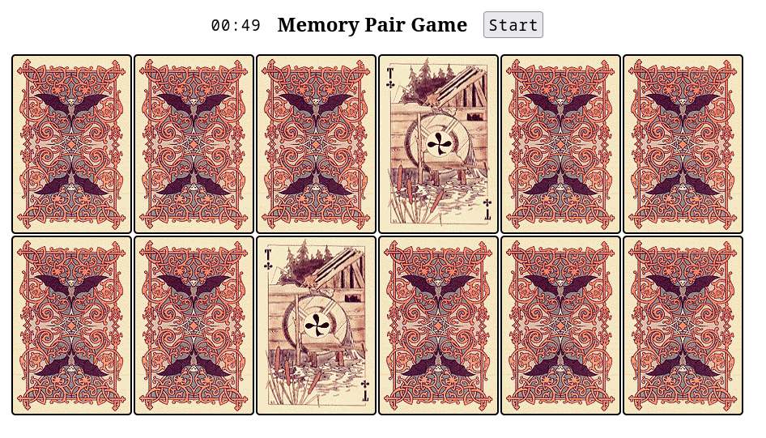
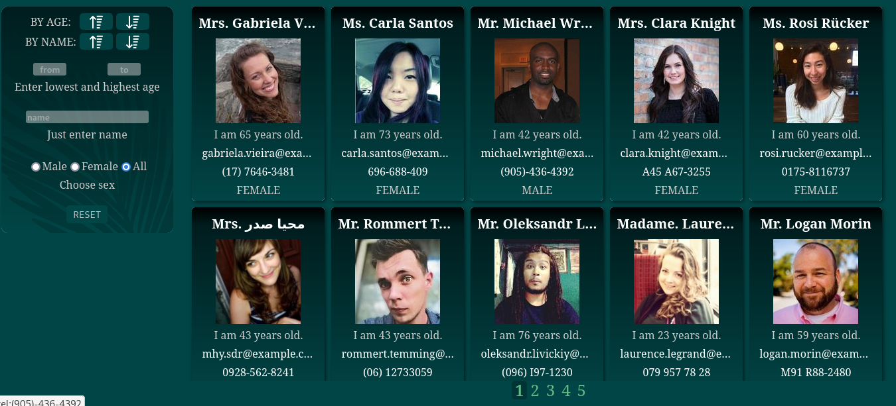
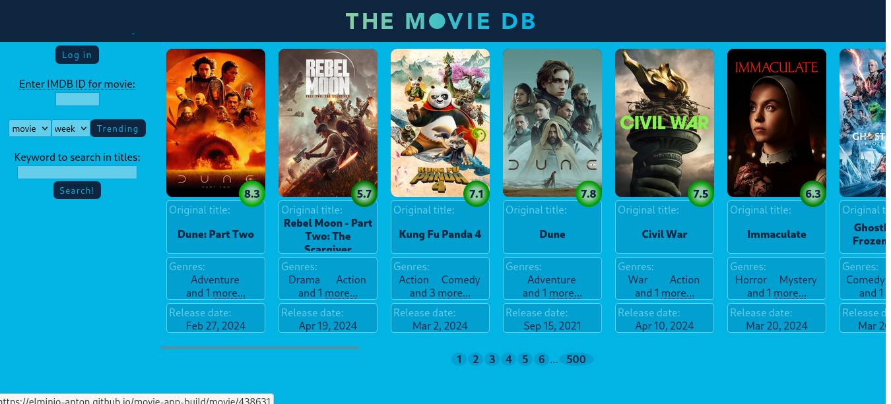
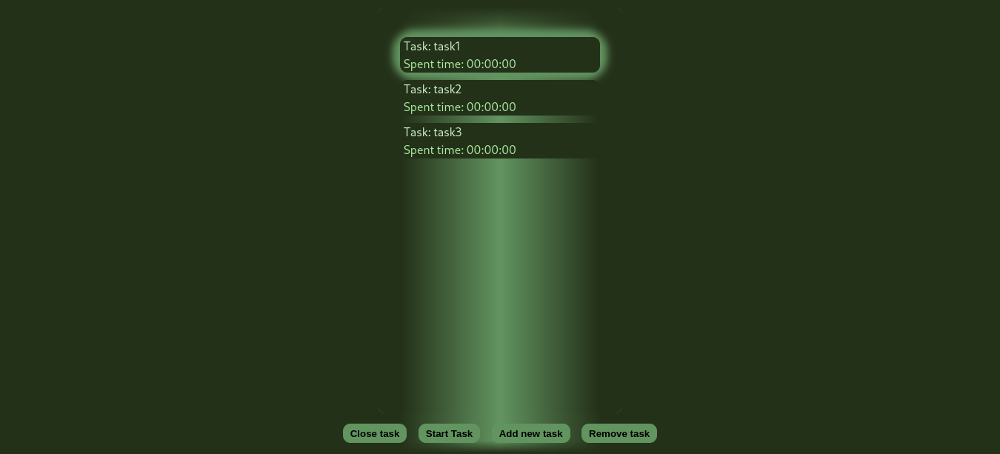

# Portfolio

# Верстка(HTML CSS)
[demo](https://elminio-anton.github.io/winary/) 
[source](https://github.com/Elminio-Anton/winary) 

  
screenshot

  

[demo](https://elminio-anton.github.io/clocks/) 
[source](https://github.com/Elminio-Anton/clocks) 

  
screenshot

  

[demo](https://elminio-anton.github.io/translight/) 
[source](https://github.com/Elminio-Anton/translight) 

  
screenshot

  

## Small projects
  [memory pair game](https://antonkottans.github.io/memory-pair-game/) - HTML,CSS,JS 
  [source](https://github.com/AntonKottans/memory-pair-game) 
  

    
screenshot

    
  

  
  [Random friends app](https://antonkottans.github.io/friends-app/) - HTML,CSS,JS 
  [source](https://github.com/AntonKottans/friends-app) 
  

    
screenshot

    
  

  
## React
  [movie-app](https://elminio-anton.github.io/movie-app-build/) - HTML,CSS,JS,React,React-router 
  [source](https://github.com/Elminio-Anton/movie-app) 
  

    
screenshot

    
  

  
  [time-management](https://elminio-anton.github.io/Time-management/) - HTML,CSS,JS,React 
  [source](https://github.com/Elminio-Anton/time-management-source) 
  

    
screenshot

    
  

