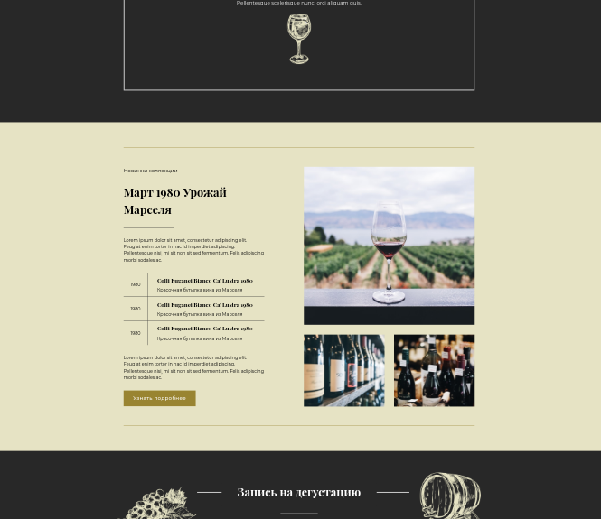
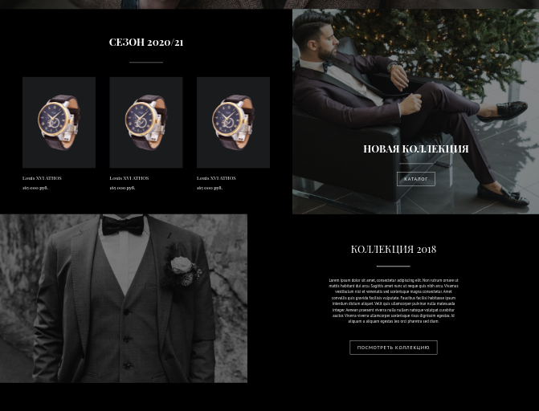
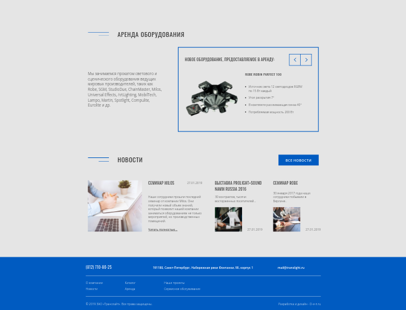

# Portfolio

# Верстка(HTML CSS)

## winary
first landing page
[demo](https://elminio-anton.github.io/winary/) 
[source](https://github.com/Elminio-Anton/winary) 

  
screenshot

  

## clocks
second landing page
[demo](https://elminio-anton.github.io/clocks/) 
[source](https://github.com/Elminio-Anton/clocks) 

  
screenshot

  

## translight
third landing page
[demo](https://elminio-anton.github.io/translight/) 
[source](https://github.com/Elminio-Anton/translight) 

  
screenshot

  

## Small projects
  [memory pair game](https://antonkottans.github.io/memory-pair-game/) 
  [source](https://github.com/AntonKottans/memory-pair-game) 
  [Random friends app](https://antonkottans.github.io/friends-app/) 
  [source](https://github.com/AntonKottans/friends-app) 
  [beauty layout](https://elminio-anton.github.io/beauty/) 
  [source](https://github.com/Elminio-Anton/beauty) 
## React
  [movie-app](https://elminio-anton.github.io/movie-app/) 
  [source](https://github.com/Elminio-Anton/movie-app) 

